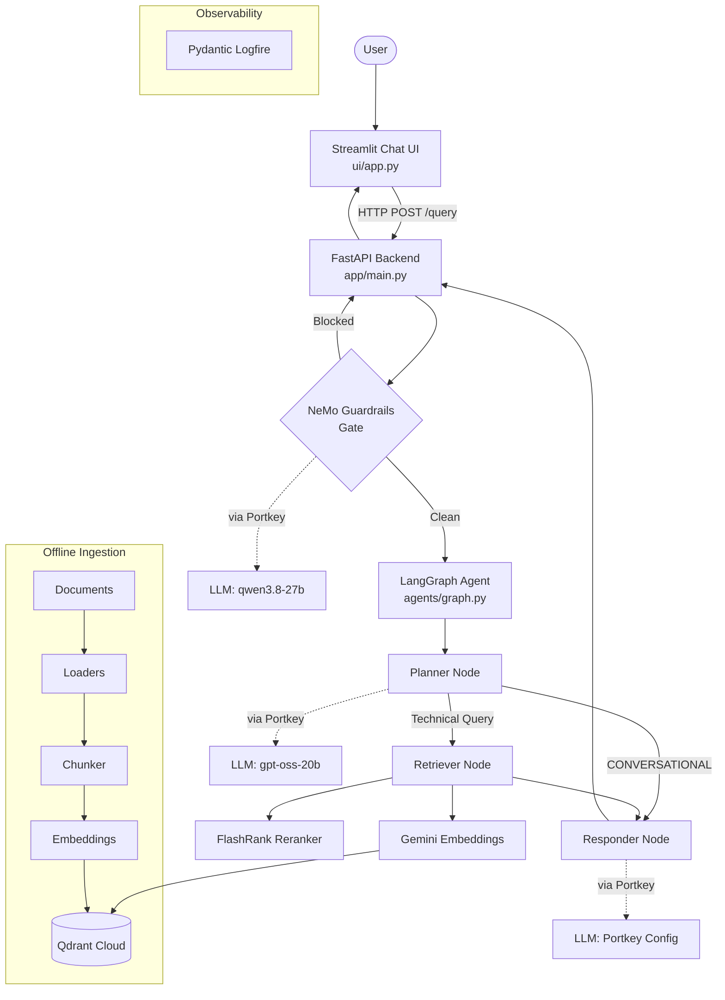
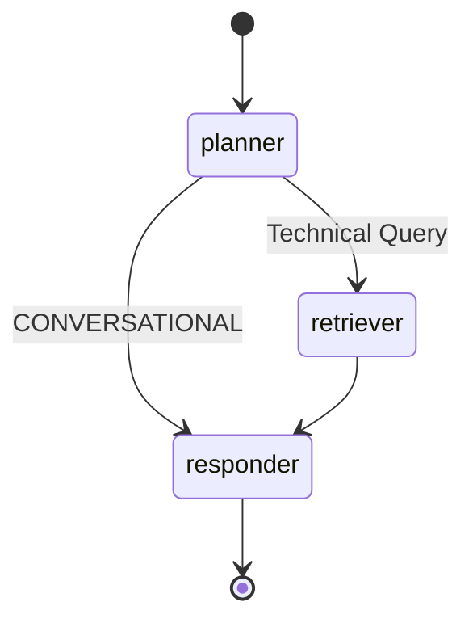

# PROJECT_CONTEXT.md — Enterprise Agentic RAG

> **Purpose:** Single-file context for AI coding assistants. Covers architecture, data flow, module interactions, and configuration — verified against implementation as of September 2026.

---

## 1. Project Overview

| Aspect               | Detail                                                                                                     |
| -------------------- | ---------------------------------------------------------------------------------------------------------- |
| **What it does**     | Enterprise Q&A system over internal documents (Kubernetes, Intel, Networking) using a LangGraph agentic RAG pipeline |
| **Application type** | FastAPI backend + Streamlit chat UI + Streamlit eval dashboard                                             |
| **LLM providers**    | Groq (primary reasoning — `qwen/qwen3.8-27b`), OpenAI-compatible models via Portkey gateway                |
| **LLM gateway**      | [Portkey](https://portkey.ai/) — routing, fallback, caching, observability wrapping all LLM calls          |
| **Embeddings**       | Google Gemini `gemini-embedding-2-preview` (768-dim) with `all-mpnet-base-v2` sentence-transformer fallback |
| **Vector DB**        | Qdrant Cloud (managed), collection `enterprise_rag`, cosine distance                                       |
| **Reranking**        | FlashRank (local ONNX `ms-marco-MiniLM-L-6-v2` cross-encoder)                                             |
| **Guardrails**       | NVIDIA NeMo Guardrails (Colang v1 rules) — off-topic, jailbreak, dialog rails                              |
| **Agent framework**  | LangGraph `StateGraph` with in-memory checkpointer for conversational memory                               |
| **Observability**    | Pydantic Logfire (spans + structured logging across all modules)                                           |
| **Evaluation**       | RAGAS metrics + custom tool correctness + guardrails binary eval; Streamlit dashboard (`evals/app.py`)     |
| **Python version**   | ≥ 3.14                                                                                                     |

---

## 2. Repository Structure

```text
Agentic-RAG/
├── app/                          # Core application
│   ├── main.py                   # FastAPI entry point, routes, startup
│   ├── config.py                 # Settings singleton (env vars)
│   ├── agents/                   # LangGraph agent definition
│   │   ├── graph.py              # StateGraph wiring, compile, MemorySaver
│   │   ├── state.py              # AgentState TypedDict
│   │   └── nodes/                # Graph node functions
│   │       ├── planner.py        # Intent classification (conversational vs technical)
│   │       ├── retriever.py      # Vector search + reranking orchestration
│   │       └── responder.py      # LLM response synthesis (Portkey native client)
│   ├── gateway/                  # Portkey LLM gateway abstraction
│   │   ├── __init__.py           # Re-exports: portkey_client, get_langchain_llm, extract_cache_status
│   │   └── client.py             # Portkey client + LangChain ChatOpenAI wrapper
│   ├── guardrails/               # NeMo Guardrails safety gate
│   │   ├── __init__.py           # Re-exports: initialize_rails, guard
│   │   ├── rails.py              # LLMRails singleton init + guard() function
│   │   └── colang_rules.py       # Colang intent/flow definitions + YAML config + RAIL_INDICATORS
│   ├── ingestion/                # Document ingestion pipeline
│   │   ├── processor.py          # Main ingestion orchestrator (CLI entry point)
│   │   ├── loaders/              # File-type-specific text extractors
│   │   │   ├── pdf.py            # pypdf + pdfplumber fallback
│   │   │   ├── html.py           # BeautifulSoup extraction
│   │   │   ├── text.py           # Plain text reader
│   │   │   └── office.py         # Unstructured (docx, pptx)
│   │   └── chunking/
│   │       └── splitter.py       # Paragraph-based chunker (1500 char chunks)
│   └── services/
│       └── retrieval/            # Retrieval stack
│           ├── embedding.py      # Gemini/fallback embedding with batching + retry
│           ├── qdrant_service.py  # Qdrant vector search (query_points)
│           └── ranking_service.py # FlashRank reranking
├── ui/
│   └── app.py                    # Streamlit chat UI (talks to FastAPI backend via HTTP)
├── evals/                        # Evaluation suite
│   ├── app.py                    # Streamlit eval dashboard (3-step: ground truth → pipeline → metrics)
│   ├── pipeline.py               # Phase 1: calls live /query for each golden sample
│   ├── metrics.py                # Phase 2: RAGAS metrics (Faithfulness, Relevancy, Precision, Recall, Correctness) + tool correctness
│   ├── guardrails_eval.py        # Guardrails binary eval (TP/TN/FP/FN, precision, recall)
│   ├── data_parser.py            # Parses DATA/ documents into tagged chunks for eval context
│   ├── golden_dataset.json       # Ground truth: 15 RAG samples + 6 guardrails test cases
│   └── og_golden_dataset.json    # Original copy of golden dataset
├── DATA/                         # Source documents for ingestion
│   ├── true_data/                # Curated enterprise docs (Kubernetes, networking — various formats)
│   └── noisy_data/               # Synthetic noise docs for robustness testing
├── processed_data/               # JSON metadata from ingestion (gitignored)
├── llm-workflow.md               # Human-readable pipeline architecture diagram
├── pyproject.toml                # Dependencies and project metadata
├── requirements.txt              # Pip requirements
└── .env                          # Environment variables (secrets)
```

### Directory Responsibility Summary

| Directory                | Responsibility                                 | Depends On               | Used By                       |
| ------------------------ | ---------------------------------------------- | ------------------------ | ----------------------------- |
| `app/agents/`            | LangGraph agent graph + nodes                  | `gateway`, `services`, `guardrails` | `app/main.py`         |
| `app/gateway/`           | Portkey LLM client abstraction                 | `app/config`             | `agents/nodes/*`, `guardrails`|
| `app/guardrails/`        | NeMo safety gate                               | `gateway`, `app/config`  | `app/main.py`                 |
| `app/ingestion/`         | Document loading, chunking, indexing           | `services/retrieval`, `app/config` | CLI (`python -m`)     |
| `app/services/retrieval/`| Embedding, vector search, reranking            | `app/config`             | `agents/nodes/retriever`, `ingestion` |
| `ui/`                    | Streamlit frontend                             | FastAPI backend (HTTP)   | End users                     |
| `evals/`                 | RAG evaluation pipeline + dashboard            | FastAPI backend (HTTP)   | Developers                    |

---

## 3. System Architecture



**Key architectural insight:** All LLM calls are routed through the **Portkey gateway**, providing unified fallback, caching, retry, and observability. The Portkey Config ID (server-side) controls the actual model routing, fallback chains, and cache policies.

---

## 4. End-to-End Data Flow

### Main Query Flow

```text
User types question in Streamlit UI
    ↓
ui/app.py → HTTP POST to /query with {q, thread_id}
    ↓
app/main.py::query() — Gate 1: Guardrails
    ↓
guardrails/rails.py::guard(message)
  → NeMo LLMRails.generate() — LLM call via Portkey (qwen3.8-27b)
  → Checks response against RAIL_INDICATORS list
  → If fired: return immediately with refusal, skip pipeline
    ↓
app/main.py::query() — Gate 2: LangGraph
    ↓
rag_agent.invoke(initial_state, config={thread_id})
    ↓
agents/nodes/planner.py::planner_node()
  → Builds prompt from conversation history + latest message
  → LLM call via Portkey (gpt-oss-20b) → outputs "CONVERSATIONAL" or a search query
    ↓
agents/graph.py::route_planner()
  → If "CONVERSATIONAL" → skip retriever → responder
  → If search query    → retriever → responder
    ↓
agents/nodes/retriever.py::retrieve_node()  [technical queries only]
  → qdrant_service.py::search_enterprise_knowledge(query, limit=15)
    → embedding.py::embed_query() — embeds the query
    → Qdrant query_points — returns 15 candidates
  → ranking_service.py::rerank_documents(query, docs, top_n=5)
    → FlashRank cross-encoder — keeps top 5
    ↓
agents/nodes/responder.py::generate_node()
  → Builds prompt with context + history
  → portkey_client.chat.completions.create() — native Portkey call
  → Checks x-portkey-cache-status header for cache hit
  → Returns final_answer + plan + messages
    ↓
app/main.py returns JSON {question, answer, thought_process, status, sources}
    ↓
ui/app.py renders with typewriter animation + expandable sources
```

### Ingestion Flow

```text
CLI: python -m app.ingestion.processor DATA --wipe
    ↓
processor.py::run_universal_ingestion()
  → Optionally wipes Qdrant collection
  → Creates collection with correct embedding dimension
  → Scans DATA/ subdirectories (true_data, noisy_data)
    ↓
processor.py::process_file() for each file
  → Loader: pdf.py / html.py / text.py / office.py
  → Chunker: splitter.py::chunk_text() — 1500 char paragraph-based
  → Save JSON metadata to processed_data/
  → Embed: embedding.py::embed_texts() — batch of 50
  → Index: qdrant_client.upsert() with payload {text, source, source_type}
```

### Evaluation Flow

```text
evals/app.py (Streamlit, 3-tab dashboard)
    ↓
Tab 1: Display golden_dataset.json (15 RAG + 6 guardrails samples)
    ↓
Tab 2: pipeline.py::run_pipeline() — calls /query for each sample
  → Captures actual_response, actual_contexts, actual_tools_called
  → guardrails_eval.py::run_guardrails_eval() — tests guardrails samples
    ↓
Tab 3: metrics.py::run_all_metrics() — 6 experiments:
  → Exp 1: Faithfulness (RAGAS)
  → Exp 2: Answer Relevancy (RAGAS)
  → Exp 3: Context Precision (RAGAS)
  → Exp 4: Context Recall (RAGAS)
  → Exp 5: Answer Correctness (RAGAS)
  → Exp 6: Tool Correctness (Jaccard, no LLM)
  → Uses separate JUDGE_GROQ key with aggressive rate limit management
```

---

## 5. Module Responsibilities

| Module                              | Responsibility                                              | Depends On                                | Used By                           |
| ----------------------------------- | ----------------------------------------------------------- | ----------------------------------------- | --------------------------------- |
| `app/main.py`                       | FastAPI app, routes (`/`, `/query`, `/graph`), startup       | `agents.graph`, `guardrails`, `pydantic`  | `ui/app.py` (HTTP)                |
| `app/config.py`                     | `Settings` class — env var loading, model/collection names   | `dotenv`                                  | All `app/` modules                |
| `app/agents/graph.py`               | LangGraph `StateGraph` wiring, `MemorySaver`, compile        | `state`, `nodes/*`                        | `app/main.py`                     |
| `app/agents/state.py`               | `AgentState` TypedDict — graph state schema                  | —                                         | `graph.py`, all `nodes/*`         |
| `app/agents/nodes/planner.py`       | Intent classification (conversational vs technical)          | `gateway`, `config`, `state`              | `graph.py`                        |
| `app/agents/nodes/retriever.py`     | Orchestrates vector search + reranking                       | `qdrant_service`, `ranking_service`, `state` | `graph.py`                     |
| `app/agents/nodes/responder.py`     | Final answer synthesis via Portkey native client             | `gateway`, `state`                        | `graph.py`                        |
| `app/gateway/client.py`             | Portkey client + `get_langchain_llm()` factory               | `portkey_ai`, `langchain_openai`, `config`| `nodes/planner`, `guardrails`     |
| `app/guardrails/rails.py`           | NeMo LLMRails singleton, `guard()` function                  | `gateway`, `colang_rules`, `config`       | `app/main.py`                     |
| `app/guardrails/colang_rules.py`    | Colang definitions, YAML config, `RAIL_INDICATORS`           | —                                         | `rails.py`                        |
| `app/services/retrieval/embedding.py`| Gemini/fallback embedding, batch + retry logic               | `langchain_google_genai`, `sentence_transformers`, `config` | `qdrant_service`, `ingestion/processor` |
| `app/services/retrieval/qdrant_service.py` | Qdrant vector search (`query_points`)                  | `qdrant_client`, `embedding`, `config`    | `nodes/retriever`                 |
| `app/services/retrieval/ranking_service.py` | FlashRank reranking                                   | `flashrank`                               | `nodes/retriever`                 |
| `app/ingestion/processor.py`        | Full ingestion pipeline + CLI entry point                    | `loaders/*`, `chunking`, `embedding`, `config` | CLI                          |
| `app/ingestion/loaders/*.py`        | File-type text extraction (PDF, HTML, TXT, Office)           | `pypdf`, `pdfplumber`, `bs4`, `unstructured` | `processor.py`                |
| `app/ingestion/chunking/splitter.py`| Paragraph-based text chunking                                | —                                         | `processor.py`, `evals/data_parser` |
| `ui/app.py`                         | Streamlit chat frontend                                      | FastAPI backend (HTTP), `logfire`          | End users                         |
| `evals/pipeline.py`                 | Live pipeline eval (calls `/query`)                          | `requests`                                | `evals/app.py`                    |
| `evals/metrics.py`                  | RAGAS + tool correctness scoring                             | `ragas`, `openai`, `pandas`               | `evals/app.py`                    |
| `evals/guardrails_eval.py`          | Guardrails binary evaluation                                 | `requests`                                | `evals/app.py`                    |
| `evals/data_parser.py`              | Parse DATA/ docs into tagged chunks for eval                 | `app/ingestion/loaders`, `chunking`       | ⚠️ Inferred: used by golden dataset creation |

---

## 6. Module Interactions

### Core Request Path

```text
app/main.py::query(QueryRequest)
  → app/guardrails/rails.py::guard(q)
      → app/gateway/client.py::get_langchain_llm() — creates guard LLM
      → nemoguardrails.LLMRails.generate()
      → Checks RAIL_INDICATORS in response
  → app/agents/graph.py::rag_agent.invoke(state, config)
      → planner_node(state)
          → app/gateway/client.py::get_langchain_llm().invoke(prompt)
          → Returns updated state {current_query, status, plan}
      → route_planner(state) — conditional edge
      → retrieve_node(state)  [if technical]
          → app/services/retrieval/qdrant_service.py::search_enterprise_knowledge(query)
              → app/services/retrieval/embedding.py::embed_query(query)
              → qdrant_client.query_points()
          → app/services/retrieval/ranking_service.py::rerank_documents(query, docs)
              → flashrank.Ranker.rerank()
          → Returns updated state {documents, status, plan}
      → generate_node(state)
          → app/gateway/client.py::portkey_client.chat.completions.create()
          → app/gateway/client.py::extract_cache_status(response)
          → Returns updated state {final_answer, status, plan, messages}
```

### LLM Gateway Interface

All LLM calls use one of two interfaces from `app/gateway/client.py`:

1. **`get_langchain_llm(model, temperature, feature)`** → `ChatOpenAI` — used by `planner_node` and `guardrails`. Wraps Portkey as an OpenAI-compatible LangChain LLM.
2. **`portkey_client`** → native `Portkey` client — used by `responder_node` to access response headers (cache status).

### Dependency Direction (no circular dependencies)

```text
config ← gateway ← guardrails ← main
config ← gateway ← agents/nodes/* ← agents/graph ← main
config ← services/retrieval/* ← agents/nodes/retriever ← agents/graph
config ← services/retrieval/* ← ingestion/processor
```

---

## 7. Core Components

### 7.1 LangGraph Agent (`app/agents/`)

- **Entry point:** `graph.py` → exports `rag_agent` (compiled `StateGraph`)
- **State:** `AgentState` TypedDict with `messages` (append-only via `operator.add`), `current_query`, `documents`, `plan`, `status`, `final_answer`
- **Nodes:** `planner` → `retriever` (conditional) → `responder` → `END`
- **Routing:** `route_planner()` — if `current_query == "CONVERSATIONAL"` → skip retriever
- **Memory:** `MemorySaver()` checkpointer — in-memory, keyed by `thread_id`
- **Invocation:** `rag_agent.invoke(initial_state, config={"configurable": {"thread_id": ...}})`

### 7.2 Portkey Gateway (`app/gateway/`)

- **Purpose:** Single abstraction for all LLM calls with unified fallback/cache/retry
- **`portkey_client`:** Native Portkey SDK client — used for response header inspection
- **`get_langchain_llm()`:** Returns `ChatOpenAI` pointed at Portkey gateway URL with metadata headers
- **`extract_cache_status()`:** Extracts `x-portkey-cache-status` header from Portkey response
- **Model routing:** Uses Portkey virtual keys (`@{slug}/model`) — the Portkey Config ID controls server-side routing

### 7.3 NeMo Guardrails (`app/guardrails/`)

- **Initialization:** `initialize_rails()` called at FastAPI startup — creates singleton `_rails: LLMRails`
- **Guard function:** `guard(message)` → returns `(bool, Optional[str])` — `(True, response)` if blocked
- **Detection:** Matches guardrail response against `RAIL_INDICATORS` substring list
- **Rules defined in Colang v1:**
  - Off-topic (jokes, weather, math, etc.)
  - Jailbreak attempts (DAN, instruction override, etc.)
  - Dialog (greetings, farewells, capabilities)
- **⚠️ Note:** `guard()` strips `<think>` tags from response (workaround for reasoning models)

### 7.4 Retrieval Stack (`app/services/retrieval/`)

- **Embedding:** Lazy-init; probes Gemini first, falls back to local `all-mpnet-base-v2`. Batch size 50 with exponential backoff for rate limits.
- **Vector Search:** `search_enterprise_knowledge(query, limit)` → embeds query → `qdrant_client.query_points()` → returns `{content, source, score}`
- **Reranking:** FlashRank ONNX cross-encoder, lazy-loaded. `rerank_documents(query, docs, top_n)` → returns re-scored top-N texts. Falls back to original Qdrant order on error.

### 7.5 Ingestion Pipeline (`app/ingestion/`)

- **CLI:** `python -m app.ingestion.processor DATA [--wipe]`
- **Loaders:** PDF (pypdf + pdfplumber fallback), HTML (BeautifulSoup), TXT, Office (Unstructured)
- **Chunking:** Paragraph-split, max 1500 chars per chunk, no overlap
- **Indexing:** UUID point IDs, payload = `{text, source, source_type}`
- **Collection management:** Auto-creates with correct dimension; `--wipe` drops and recreates

### 7.6 Evaluation Suite (`evals/`)

- **Dashboard:** Streamlit 3-tab app (`evals/app.py`)
- **Phase 1 (pipeline.py):** Calls live `/query` endpoint, captures responses + contexts + tool decisions
- **Phase 2 (metrics.py):** 6 RAGAS metrics via Groq-hosted judge model (`llama-3.1-8b-instant`), aggressive rate limiting (1 sample at a time, 40s cooldowns)
- **Guardrails eval:** Binary classification (TP/TN/FP/FN) with precision/recall/accuracy
- **Golden dataset:** 15 RAG samples across 5 domains + 6 guardrails test cases

---

## 8. Configuration & Environment

### Environment Variables (from `.env`)

| Variable                  | Purpose                                      | Required |
| ------------------------- | -------------------------------------------- | -------- |
| `GROQ_API_KEY`            | Primary Groq API key for LLM calls           | Yes      |
| `GROQ_FALLBACK_API_KEY`   | Fallback Groq key                            | No       |
| `PORTKEY_API_KEY`         | Portkey gateway API key                      | Yes      |
| `PORTKEY_CONFIG_ID`       | Portkey server-side config (routing/fallback) | Yes      |
| `QDRANT_API_KEY`          | Qdrant Cloud authentication                  | Yes      |
| `QDRANT_CLUSTER_ENDPOINT` | Qdrant Cloud cluster URL                     | Yes      |
| `GEMINI_API_KEY`          | Google Gemini embedding API key              | No (falls back to local) |
| `LOGFIRE_TOKEN`           | Pydantic Logfire observability token         | No       |
| `LANGSMITH_API_KEY`       | LangSmith tracing (commented out)            | No       |
| `LANGSMITH_PROJECT`       | LangSmith project name                       | No       |
| `BACKEND_URL`             | FastAPI backend URL for UI/evals             | No (default: `http://localhost:8000`) |
| `JUDGE_GROQ`              | Separate Groq key for eval judge LLM         | No (falls back to `GROQ_API_KEY`) |

### Configuration Constants (`app/config.py` → `Settings` class)

| Constant              | Value                   | Location        |
| --------------------- | ----------------------- | --------------- |
| `QDRANT_COLLECTION`   | `"enterprise_rag"`      | `config.py`     |
| `GROQ_MODEL`          | `"qwen/qwen3.8-27b"`   | `config.py`     |
| `GROQ_SLUG`           | `"rag"` (primary)       | `config.py`     |
| `GROQ_SLUG_2`         | `"llm1"` (fallback)     | `config.py`     |
| `BATCH_SIZE`           | `50` (embedding)        | `embedding.py`  |
| `chunk_size`           | `1500` chars            | `splitter.py`   |
| Retrieval `limit`      | `15` candidates         | `retriever.py`  |
| Reranking `top_n`      | `5`                     | `retriever.py`  |
| Context `max_chars`    | `25000`                 | `responder.py`  |

### Critical Startup Order

```text
1. logfire.configure()  ← MUST be before all other imports in main.py
2. load_dotenv()
3. Import app modules
4. FastAPI startup event → initialize_rails()
```

---

## 9. Data Models & Schemas

### AgentState (`app/agents/state.py`)

```python
class AgentState(TypedDict):
    messages: Annotated[List[dict], operator.add]  # append-only chat history
    current_query: str       # "CONVERSATIONAL" or refined search query
    documents: List[str]     # retrieved + reranked context chunks
    plan: List[str]          # thought process trace for UI display
    status: str              # human-readable status string
    final_answer: str        # synthesized LLM response
```

### QueryRequest (`app/main.py`)

```python
class QueryRequest(BaseModel):
    q: str
    thread_id: Optional[str] = "default_user"
```

### API Response (JSON, not a Pydantic model)

```json
{
  "question": "str",
  "answer": "str",
  "thought_process": ["str"],
  "status": "str",
  "sources": ["str"]
}
```

### Golden Dataset Schema (`evals/golden_dataset.json`)

```json
{
  "rag_samples": [{
    "id": "int",
    "domain": "str",
    "question": "str",
    "reference": "str",
    "relevant_contexts": ["str"],
    "expected_tools": ["str"],
    "actual_response": "str",
    "actual_contexts": ["str"],
    "actual_tools_called": ["str"]
  }],
  "guardrails_samples": [{
    "id": "str",
    "input": "str",
    "expected_blocked": "bool",
    "type": "str",
    "description": "str",
    "actual_blocked": "bool | null",
    "result": "str | null"
  }]
}
```

---

## 10. Database / Storage Architecture

### Qdrant Cloud

| Property        | Value                                     |
| --------------- | ----------------------------------------- |
| **Provider**    | Qdrant Cloud (managed)                    |
| **Collection**  | `enterprise_rag`                          |
| **Distance**    | Cosine                                    |
| **Dimensions**  | 768 (Gemini preview) or 768 (fallback)    |
| **Point ID**    | UUID v4 strings                           |

### Point Payload Schema

```json
{
  "text": "chunk content string",
  "source": "filename.pdf",
  "source_type": "true | noisy | general"
}
```

### Local Storage

- `processed_data/<source_type>/<filename>.json` — parsed chunk metadata (gitignored)
- `DATA/true_data/` — curated enterprise documents (Kubernetes docs in pptx/docx/html/txt)
- `DATA/noisy_data/` — synthetic noise documents for robustness testing

---

## 11. RAG Architecture

### Complete Pipeline

```text
Documents (DATA/)
 → Loaders (pdf.py, html.py, text.py, office.py)
     Extract raw text from PDF/HTML/TXT/DOCX/PPTX
 → Chunker (splitter.py::chunk_text)
     Paragraph-split, max 1500 chars, no overlap
 → Embeddings (embedding.py::embed_texts)
     Gemini gemini-embedding-2-preview (768-dim)
     Fallback: all-mpnet-base-v2 (768-dim)
     Batch size: 50, exponential backoff for rate limits
 → Vector Storage (processor.py → qdrant_client.upsert)
     Qdrant Cloud, cosine distance, payload: {text, source, source_type}

--- Query Time ---

 → Query Embedding (embedding.py::embed_query)
     Same model as ingestion
 → Vector Retrieval (qdrant_service.py::search_enterprise_knowledge)
     qdrant_client.query_points(), limit=15
 → Reranking (ranking_service.py::rerank_documents)
     FlashRank ms-marco-MiniLM-L-6-v2 (local ONNX cross-encoder)
     top_n=5
 → Context Construction (responder.py::generate_node)
     Concatenates top chunks, truncated at 25,000 chars
 → LLM Synthesis (responder.py via Portkey)
     Builds prompt with context + conversation history
     temperature=0.1
 → Response (JSON to UI)
     Includes thought_process trace and source chunks
```

### Key Parameters

| Parameter          | Value     | Location           |
| ------------------ | --------- | ------------------ |
| Chunk size         | 1500 chars | `splitter.py`     |
| Chunk overlap      | 0         | `splitter.py`      |
| Embedding batch    | 50        | `embedding.py`     |
| Vector candidates  | 15        | `retriever.py`     |
| Rerank top-N       | 5         | `retriever.py`     |
| Context max chars  | 25,000    | `responder.py`     |
| LLM temperature    | 0.1       | `responder.py`     |

### Citation / Source Handling

Retrieved chunks are returned in the API response as `sources` (list of formatted strings). The UI displays them in nested expandable sections. No structured citation with page numbers or document sections is implemented.

---

## 12. Agent / LLM Architecture

### LangGraph Graph Structure



### Node Details

| Node       | LLM                               | Via           | Purpose                              |
| ---------- | --------------------------------- | ------------- | ------------------------------------ |
| `planner`  | `@llm1/openai/gpt-oss-20b`       | Portkey (LangChain) | Intent classification          |
| `responder`| Portkey Config ID (server-side)   | Portkey (native)    | Answer synthesis               |
| `retriever`| — (no LLM call)                   | —             | Vector search + reranking            |

### Guardrails LLM

| Component    | LLM                                      | Via           |
| ------------ | ----------------------------------------- | ------------- |
| `guard()`    | `@rag/qwen/qwen3.8-27b`                  | Portkey (LangChain) |

### Memory

- **Type:** LangGraph `MemorySaver` (in-memory)
- **Key:** `thread_id` (passed in `QueryRequest`)
- **Behavior:** Messages are appended (`operator.add`) — full conversation history available to planner and responder
- **Limitation:** In-memory only; resets on server restart

### Prompt Strategy

- **Planner:** System instruction + conversation history + latest message → outputs "CONVERSATIONAL" or refined search query
- **Responder (conversational):** Friendly assistant persona + history + latest message
- **Responder (technical):** "Senior Technical Architect" persona + retrieved context + history + question
- **Guardrails:** NeMo Colang flow definitions + YAML system instructions

---

## 13. API Architecture

### FastAPI Endpoints (`app/main.py`)

| Method | Endpoint  | Purpose                                | Input                          | Output                              | Auth |
| ------ | --------- | -------------------------------------- | ------------------------------ | ----------------------------------- | ---- |
| `GET`  | `/`       | Health check                           | —                              | `{"message": "..."}`                | None |
| `POST` | `/query`  | Main RAG query endpoint                | `QueryRequest {q, thread_id}` | `{question, answer, thought_process, status, sources}` | None |
| `GET`  | `/graph`  | Returns Mermaid diagram of agent graph | —                              | `image/png`                         | None |

**No authentication or RBAC is implemented.**

---

## 14. Error Handling & Observability

### Error Handling

- **`/query` endpoint:** Top-level try/except returns graceful error response JSON
- **Embedding:** Exponential backoff (4 attempts) for Gemini rate limits (429/quota errors)
- **Reranking:** Falls back to original Qdrant order on FlashRank failure
- **Guardrails:** Returns `(False, None)` if rails not initialized — allows request through
- **Responder:** Re-raises LLM generation errors (caught by top-level handler)
- **Qdrant search:** Returns empty list on failure
- **UI:** Displays "Backend Offline" on connection errors

### Observability (Logfire)

- **All modules** use `logfire.span()` for structured tracing and `logfire.info/warning/error()` for logging
- **Critical order:** `logfire.configure()` must run before all imports in `main.py` and `evals/app.py`
- **Spans cover:** Guardrails check, planner decision, knowledge retrieval, semantic reranking, LLM synthesis, embedding batches, ingestion processing, eval pipeline steps
- **UI:** Initializes logfire separately with its own token; `instrument_requests()` disabled due to OpenTelemetry bug on Windows

### Other Observability (present in dependencies but limited usage)

- **LangSmith:** `langsmith` + `langfuse` in dependencies; env vars present but commented out / empty
- **Portkey:** Built-in observability via Portkey dashboard (metadata: `feature`, `_user`, `environment`)

---

## 15. Testing & Evaluation

### Evaluation Suite (no unit tests)

| Component                | Type               | Location                    | How to Run                                        |
| ------------------------ | ------------------ | --------------------------- | ------------------------------------------------- |
| Golden dataset           | Ground truth       | `evals/golden_dataset.json` | —                                                 |
| Live pipeline eval       | Integration (live) | `evals/pipeline.py`         | Via `evals/app.py` Step 2                         |
| RAGAS metrics            | LLM-judged eval    | `evals/metrics.py`          | Via `evals/app.py` Step 3                         |
| Tool correctness         | Jaccard similarity | `evals/metrics.py`          | Via `evals/app.py` Step 3 (Exp 6)                 |
| Guardrails binary eval   | Binary classification | `evals/guardrails_eval.py` | Via `evals/app.py` Step 2                        |

### RAGAS Metrics Used

| Metric              | Judge Model              | LLM Required |
| -------------------- | ------------------------ | ------------ |
| Faithfulness         | `llama-3.1-8b-instant`   | Yes          |
| Answer Relevancy     | `llama-3.1-8b-instant`   | Yes          |
| Context Precision    | `llama-3.1-8b-instant`   | Yes          |
| Context Recall       | `llama-3.1-8b-instant`   | Yes          |
| Answer Correctness   | `llama-3.1-8b-instant`   | Yes          |
| Tool Correctness     | — (Jaccard)              | No           |

### Rate Limit Management for Evals

- Batch size: 1 sample at a time
- Cooldown between samples: 40s
- Cooldown between experiments: 62s
- Context truncated to 300 chars, 2 chunks max per sample
- Total runtime for full eval: ~50 minutes

**⚠️ No unit tests, integration tests, or CI/CD pipeline exists.**

---

## 16. Dependencies

### Key Dependencies (from `pyproject.toml`)

| Category         | Package                       | Purpose                                      |
| ---------------- | ----------------------------- | -------------------------------------------- |
| **Web/API**      | `fastapi`, `uvicorn`          | Backend API server                           |
| **UI**           | `streamlit`                   | Chat UI + eval dashboard                     |
| **Agent**        | `langgraph`, `langchain`, `langchain-core` | Agent framework, graph, state management |
| **LLM**          | `langchain-openai`            | ChatOpenAI wrapper (via Portkey)             |
|                  | `langchain-groq`              | ⚠️ In deps but not directly imported — Portkey handles Groq routing |
|                  | `langchain-google-genai`      | Gemini embeddings                            |
|                  | `portkey-ai`                  | LLM gateway (routing, fallback, cache)       |
| **RAG**          | `qdrant-client`               | Vector database client                       |
|                  | `sentence-transformers`       | Fallback embeddings (`all-mpnet-base-v2`)    |
|                  | `flashrank`                   | Local ONNX reranker                          |
| **Guardrails**   | `nemoguardrails`              | NeMo safety rails (Colang v1)               |
| **Ingestion**    | `pypdf`, `pdfplumber`         | PDF parsing (primary + fallback)             |
|                  | `beautifulsoup4`              | HTML parsing                                 |
|                  | `python-docx`, `python-pptx`  | Office document parsing                      |
|                  | `unstructured`                | General-purpose document parsing             |
| **Evaluation**   | `ragas`                       | RAG evaluation metrics                       |
|                  | `deepeval`                    | ⚠️ In deps but not imported in code          |
| **Observability**| `logfire[fastapi,requests]`   | Structured tracing + logging                 |
|                  | `langsmith`, `langfuse`       | ⚠️ In deps but not actively configured       |
| **Utility**      | `python-dotenv`, `pydantic`   | Env loading, data validation                 |
|                  | `nest-asyncio`                | Enables nested event loops (for Streamlit + async RAGAS) |

---

## 17. Important Execution Paths

### User Query → Answer

```text
app/main.py::query()
  → app/guardrails/rails.py::guard()
  → app/agents/graph.py::rag_agent.invoke()
    → app/agents/nodes/planner.py::planner_node()
    → app/agents/nodes/retriever.py::retrieve_node()
      → app/services/retrieval/qdrant_service.py::search_enterprise_knowledge()
        → app/services/retrieval/embedding.py::embed_query()
      → app/services/retrieval/ranking_service.py::rerank_documents()
    → app/agents/nodes/responder.py::generate_node()
      → app/gateway/client.py::portkey_client.chat.completions.create()
```

### Document Ingestion

```text
app/ingestion/processor.py::run_universal_ingestion()  [CLI __main__]
  → process_directory() → process_file()
    → app/ingestion/loaders/pdf.py::parse_pdf()  (or html/text/office)
    → app/ingestion/chunking/splitter.py::chunk_text()
    → app/services/retrieval/embedding.py::embed_texts()
    → qdrant_client.upsert()
```

### Evaluation

```text
evals/app.py (Streamlit)
  → evals/pipeline.py::run_pipeline()        [Phase 1]
  → evals/guardrails_eval.py::run_guardrails_eval()  [Phase 1b]
  → evals/metrics.py::run_all_metrics()       [Phase 2]
```

---

## 18. Extension Points

| Task                         | Where to Add                                                    |
| ---------------------------- | --------------------------------------------------------------- |
| New API endpoint             | `app/main.py` — add new route function                          |
| New LangGraph node           | `app/agents/nodes/` — new file; register in `graph.py`          |
| New LLM provider             | `app/gateway/client.py` — add new client or update Portkey config |
| New retrieval strategy       | `app/services/retrieval/` — new service file; call from `retriever.py` |
| New document loader          | `app/ingestion/loaders/` — new file; add extension case in `processor.py::process_file()` |
| New guardrail rule           | `app/guardrails/colang_rules.py` — add Colang define blocks + update `RAIL_INDICATORS` |
| New evaluation metric        | `evals/metrics.py` — add new experiment section in `run_all_metrics()` |
| New golden dataset samples   | `evals/golden_dataset.json` — add to `rag_samples` or `guardrails_samples` |
| Persistent memory            | Replace `MemorySaver()` in `graph.py` with `SqliteSaver` or external store |
| New chunking strategy        | `app/ingestion/chunking/` — new splitter; update `processor.py` import |

---

## 19. Architectural Constraints & Important Decisions

| Decision                                       | Rationale / Evidence                                                    |
| ---------------------------------------------- | ----------------------------------------------------------------------- |
| **All LLM calls through Portkey**              | Unified fallback, caching, retry, and observability; avoids vendor lock-in |
| **Portkey Config ID (server-side)**            | Routing/fallback logic managed in Portkey dashboard, not in code         |
| **Logfire configured before all imports**      | OpenTelemetry instrumentation must be active before module-level code runs |
| **Responder uses native Portkey client**       | Needed to access `x-portkey-cache-status` response header — LangChain wrapper doesn't expose it |
| **Embedding fallback (Gemini → sentence-transformers)** | Graceful degradation if Gemini API is down or key is missing       |
| **Embedding dimension = 768**                  | Both Gemini preview and fallback produce 768-dim vectors; collection dimension set at runtime |
| **FlashRank for reranking (local ONNX)**       | No API cost, ultra-fast cross-encoder; avoids external service dependency |
| **In-memory MemorySaver**                      | Simple, no database dependency; conversation state lost on restart       |
| **Synchronous `rag_agent.invoke()`**           | Preserves Logfire context variables (async would lose span context)       |
| **Paragraph-based chunking (no overlap)**      | Simple strategy; 1500 chars chosen to balance context quality and embedding cost |
| **Separate JUDGE_GROQ key for evals**          | Prevents eval runs from exhausting production Groq rate limits            |
| **Aggressive rate limiting in evals**          | Groq free/on-demand tier has 6,000 TPM limit; 1-sample batching + 40s cooldowns |
| **Domain restricted to Kubernetes/Intel/Networking** | Guardrails Colang rules enforce domain scope; planner prompt reinforces it |
| **NeMo Guardrails think tag stripping**        | Workaround for reasoning models that output thinking tokens              |

---

## 20. Known Issues / Technical Debt

### Confirmed

- **No unit tests or CI/CD** — only live evaluation pipeline exists
- **In-memory conversation state** — all conversations lost on server restart (`MemorySaver`)
- **OpenTelemetry bug on Windows** — `instrument_requests()` disabled in UI due to `MeterProvider.get_meter()` conflict (see `ui/app.py` line 21)
- **Hardcoded `/tmp/flashrank` cache directory** — will fail on Windows; falls back to default on error (`ranking_service.py` line 19)
- **No authentication/authorization** — API is completely open
- **`deepeval` dependency installed but unused** — present in `pyproject.toml` but not imported anywhere
- **`langchain-nvidia-ai-endpoints`, `langchain-google-vertexai`** — in dependencies but not imported in code
- **`langfuse`, `langsmith`** — in dependencies but not actively configured (env vars empty)
- **Secrets committed in `.env`** — `.env` is gitignored but present in the working directory with real keys
- **`GEMINI_API_KEY` commented out in `.env`** — Gemini embeddings will fall back to local model

### ⚠️ Inferred Concerns

- **No chunk overlap** — may lose context at chunk boundaries for long documents
- **No metadata filtering** — vector search queries all documents regardless of source type
- **No streaming** — UI simulates streaming via character-by-character display, but backend returns full response
- **Eval runtime ~50 min** — due to aggressive rate limit management for Groq free tier
- **`evals/data_parser.py`** appears to be a utility for creating the golden dataset but is not called by the eval pipeline itself
- **`og_golden_dataset.json`** is an exact copy of `golden_dataset.json` — purpose unclear (backup?)

---

## 21. Developer Workflow

### Install Dependencies

```bash
# Using uv (recommended, as uv.lock exists)
uv sync

# Or using pip
pip install -r requirements.txt
```

### Run the Backend

```bash
uvicorn app.main:app --reload --port 8000
```

### Run the Chat UI

```bash
streamlit run ui/app.py
```

### Run Document Ingestion

```bash
# Ingest all documents from DATA/ directory
python -m app.ingestion.processor DATA

# Wipe collection and re-ingest
python -m app.ingestion.processor DATA --wipe

# Ingest specific subdirectory with explicit type
python -m app.ingestion.processor DATA/true_data true
```

### Run the Evaluation Dashboard

```bash
# Requires the backend to be running on port 8000
streamlit run evals/app.py
```

### View Agent Graph

```
GET http://localhost:8000/graph  → returns PNG image
```

---

## 22. Copilot Quick Reference

```text
Architecture:
  FastAPI backend + LangGraph agent + Qdrant vector DB + Portkey LLM gateway
  Streamlit chat UI (frontend) + Streamlit eval dashboard
  NeMo Guardrails safety gate before agent pipeline

Main entry point:
  app/main.py → FastAPI app, POST /query endpoint

Primary request flow:
  /query → guard() → rag_agent.invoke()
    → planner_node (intent) → [retriever_node (search+rerank)] → responder_node (LLM)

RAG flow:
  embed_query() → Qdrant query_points(limit=15) → FlashRank rerank(top_n=5) → LLM synthesis

Agent graph:
  planner → (conditional) → retriever → responder → END
  State: AgentState TypedDict (messages, current_query, documents, plan, status, final_answer)
  Memory: MemorySaver (in-memory, keyed by thread_id)

LLM calls (ALL via Portkey gateway):
  Guardrails: @rag/qwen/qwen3.8-27b
  Planner:    @llm1/openai/gpt-oss-20b
  Responder:  Portkey Config ID (server-side routing)

Vector DB:
  Qdrant Cloud, collection "enterprise_rag", 768-dim cosine

Embeddings:
  Gemini gemini-embedding-2-preview (768-dim) → fallback: all-mpnet-base-v2

Reranker:
  FlashRank (local ONNX ms-marco-MiniLM-L-6-v2)

Important modules:
  app/agents/graph.py         — LangGraph wiring
  app/agents/nodes/           — planner, retriever, responder
  app/gateway/client.py       — Portkey abstraction
  app/guardrails/rails.py     — NeMo guard() function
  app/services/retrieval/     — embedding, qdrant, reranking
  app/ingestion/processor.py  — document ingestion CLI
  app/config.py               — Settings singleton

Configuration:
  .env file → GROQ_API_KEY, PORTKEY_API_KEY, PORTKEY_CONFIG_ID,
              QDRANT_API_KEY, QDRANT_CLUSTER_ENDPOINT, GEMINI_API_KEY,
              LOGFIRE_TOKEN, BACKEND_URL, JUDGE_GROQ

Testing:
  No unit tests — only live eval suite via evals/app.py (Streamlit)
  RAGAS metrics: Faithfulness, Answer Relevancy, Context Precision/Recall, Answer Correctness
  Tool correctness: Jaccard similarity (no LLM)

When modifying retrieval, inspect:
  app/services/retrieval/ (embedding, qdrant_service, ranking_service)
  app/agents/nodes/retriever.py

When modifying LLM behavior, inspect:
  app/gateway/client.py (Portkey client setup)
  app/agents/nodes/responder.py (prompt construction)
  app/agents/nodes/planner.py (intent classification prompt)

When modifying guardrails, inspect:
  app/guardrails/colang_rules.py (Colang definitions + RAIL_INDICATORS)
  app/guardrails/rails.py (guard function logic)

When modifying ingestion, inspect:
  app/ingestion/processor.py (orchestrator)
  app/ingestion/loaders/ (file-type parsers)
  app/ingestion/chunking/splitter.py
```
