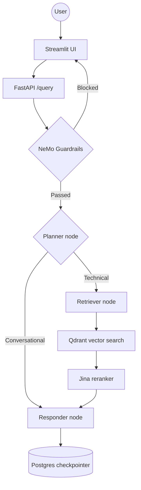

# Enterprise Agentic RAG

This repository is a working end-to-end RAG system for enterprise document search and answer generation. The current implementation uses a LangGraph workflow, a FastAPI backend, a Qdrant vector store, Jina embeddings + reranking, a Portkey LLM gateway, and Postgres-backed conversation memory.

## Key features

- Agentic workflow orchestration with LangGraph and planner/retriever/responder routing
- Durable conversation memory using a Postgres-backed LangGraph checkpointer with MemorySaver fallback
- Qdrant vector search with Jina embeddings and reranking for higher-quality citations
- NeMo Guardrails integration to block unsafe or irrelevant requests before retrieval/generation
- FastAPI backend with auth, rate limiting, Prometheus metrics, and health endpoints
- Streamlit chat UI for direct interaction and thread browsing
- Local ingestion pipeline for PDF, HTML, TXT, DOCX, and PPTX content
- Observability through Logfire and LangSmith tracing
- Built-in eval scripts for quality assessment with RAGAS

## What the project does today

- Processes local documents from `DATA/` and stores chunked metadata under `processed_data/`
- Embeds and indexes content in Qdrant for semantic retrieval
- Retrieves relevant chunks and reranks them before generation
- Uses a LangGraph planner/retriever/responder flow to decide when the system needs retrieval vs. a direct answer
- Persists conversation state with a Postgres checkpointer and falls back to in-memory memory only if Postgres is unavailable
- Applies NeMo Guardrails before retrieval and generation
- Serves the app through FastAPI and a Streamlit chat UI
- Exposes metrics at `/metrics` and health checks through the app health router
- Includes an evaluation suite under `evals/` for RAGAS-based assessment

## Current architecture



## Key implementation details

- Backend entrypoint: `app/main.py`
- Agent graph: `app/agents/graph.py`
- Planner, retriever, and responder nodes: `app/agents/nodes/`
- Model routing and gateway setup: `app/gateway/client.py`
- Configuration and environment validation: `app/config.py`
- Guardrails: `app/guardrails/`
- Document ingestion and chunking: `app/ingestion/`
- Retrieval and ranking: `app/services/retrieval/`
- UI: `ui/app.py`
- Evaluation scripts: `evals/`

## Tech stack

- API: FastAPI
- Agent orchestration: LangGraph
- LLM gateway: Portkey AI
- Guardrails: NeMo Guardrails
- Vector store: Qdrant
- Embeddings: Jina `jina-embeddings-v3`
- Reranking: Jina reranker API
- Durable memory: Neon / Postgres via `langgraph-checkpoint-postgres`
- Rate limiting / cache: Redis + Upstash REST
- Observability: Pydantic Logfire + LangSmith
- UI: Streamlit
- Evaluation: RAGAS

## Project structure

```text
.
├── app/
│   ├── agents/
│   │   ├── nodes/
│   │   ├── graph.py
│   │   └── state.py
│   ├── gateway/
│   ├── guardrails/
│   ├── ingestion/
│   ├── services/
│   ├── config.py
│   ├── health.py
│   ├── logging.py
│   └── main.py
├── DATA/
├── evals/
├── processed_data/
├── ui/
├── .env.example
├── pyproject.toml
├── requirements.txt
├── requirements-current.txt
├── README.md
├── workflow.md
├── llm-workflow.md
└── LICENSE
```

## Local setup

### 1. Create a virtual environment and install dependencies

```powershell
python -m venv .venv
.\.venv\Scripts\activate
pip install -r requirements.txt
```

If you prefer the package metadata flow instead of raw requirements, this repo also supports:

```powershell
pip install -e .
```

### 2. Configure environment variables

Copy `.env.example` to `.env` and fill in the values for your environment.

```env
OPENAI_API_KEY=
PORTKEY_API_KEY=
PORTKEY_PRIMARY_SLUG=rag
PORTKEY_FALLBACK_SLUG=llm1
PORTKEY_PRIMARY_CONFIG_ID=
PORTKEY_PLANNER_CONFIG_ID=
PORTKEY_RESPONDER_CONFIG_ID=
PORTKEY_GUARDRAILS_CONFIG_ID=
PORTKEY_EVALS_CONFIG_ID=
JINA_API_KEY=
QDRANT_API_KEY=
QDRANT_CLUSTER_ENDPOINT=
NEON_DB_URL=
UPSTASH_REDIS_REST_URL=
UPSTASH_REDIS_REST_TOKEN=
RAG_API_KEY=
RATE_LIMIT_PER_MINUTE=20
LOGFIRE_TOKEN=
LOGFIRE_BASE_URL=https://logfire-eu.pydantic.dev
LANGSMITH_TRACING=true
LANGSMITH_API_KEY=
LANGSMITH_PROJECT=rag_scale_test
LANGSMITH_ENDPOINT=https://api.smith.langchain.com
BACKEND_URL=http://localhost:8000
JUDGE_OPENAI_API_KEY=
```

Important notes:

- This project expects real Portkey saved-config IDs such as `PORTKEY_PRIMARY_CONFIG_ID` and the optional feature-specific IDs in `.env`.
- `QDRANT_URL` is also accepted as an alias for `QDRANT_CLUSTER_ENDPOINT` in configuration.
- `app/config.py` treats empty `QDRANT_API_KEY` values as unset, which is useful for local or permissive Qdrant setups.
- `MEMORY_REQUIRE_DURABLE_CHECKPOINTER` can be set to `true` to fail startup if Postgres-backed memory is unavailable.

### 3. Verify external dependencies

Before starting the backend, you can check connectivity and service health:

```powershell
python -m app.services.health.connection_checker
```

### 4. Start the backend

```powershell
uvicorn app.main:app --reload --port 8000
```

The API exposes:

- `/` — service liveness message
- `/query` — synchronous RAG request endpoint
- `/memory/{thread_id}` — retrieve conversation memory for a thread
- `/memory` — list recent threads
- `/graph` — returns a Mermaid graph image
- `/metrics` — Prometheus metrics

### 5. Start the Streamlit UI

```powershell
streamlit run ui/app.py
```

The UI expects `BACKEND_URL` to point to the FastAPI server, which defaults to `http://localhost:8000`.

## Ingest documents

The ingestion pipeline parses local files from `DATA/`, chunks them, saves processed output under `processed_data/`, and indexes them into Qdrant.

```powershell
python -m app.ingestion.processor DATA --wipe
```

- Use `--wipe` to recreate the Qdrant collection and refresh indexes.
- Omit it to append to the existing collection.

## Query the API

```powershell
curl -X POST "http://localhost:8000/query" \
  -H "Content-Type: application/json" \
  -d '{"q":"How do I start Redis for a Kubernetes work queue?","thread_id":"user-1"}'
```

A typical response looks like:

```json
{
  "question": "How do I start Redis for a Kubernetes work queue?",
  "answer": "...",
  "thought_process": ["..."],
  "status": "success",
  "sources": ["..."]
}
```

## Run the eval suite

The evaluation scripts live under `evals/` and can be run either headlessly or through the app UI.

```powershell
python -m evals.run_evals
```

Or start the demo UI:

```powershell
streamlit run evals/app.py
```

## Notes and operational guidance

- The project is designed for a durable Postgres checkpointer in production and falls back to `MemorySaver` only when Postgres is not reachable.
- Redis is used for rate limiting and may fallback to in-memory storage if the Redis connection is unavailable.
- `STRICT_STARTUP` in `app/config.py` can be enabled to fail startup when required dependencies are unhealthy.
- Guardrails are initialized during app startup through `initialize_rails()` in `app.main`.
- This repo includes both backend and UI components; if you only want to test the API, the UI can be skipped.

## Development checks

```powershell
ruff check app evals ui
ruff format --check app evals ui
pytest
```

This project is configured for Python 3.11+ and is intended to be run from the repository root.
