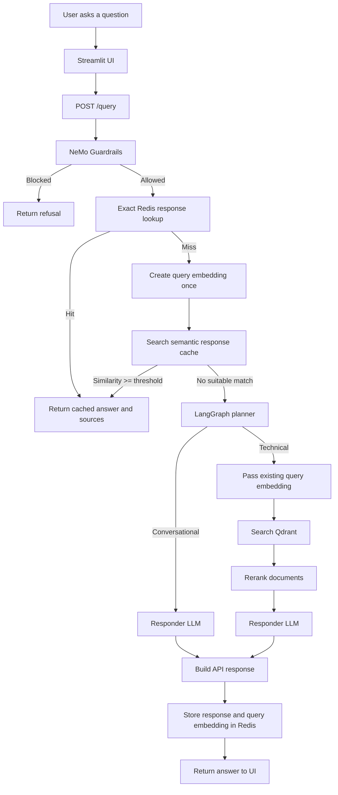

# Agentic RAG Workflow and Caching

## Overview

The application has two Redis-backed response-cache mechanisms:

1. **Response cache**: returns a complete answer and its sources before LangGraph runs.
2. **Semantic response cache**: reuses a complete answer for a sufficiently similar question.

The response cache is checked after guardrails. This means a cached answer cannot bypass the safety gate.

## Conversation Memory

Conversation memory is managed by LangGraph checkpoints and keyed by `thread_id`:

1. Streamlit creates one session ID for a chat session.
2. The UI sends that ID as `thread_id` with every request.
3. LangGraph loads the checkpoint for that thread from Postgres.
4. The current user message is appended to the bounded message history.
5. Planner and responder nodes read the retained history.
6. The updated state is persisted back to the same thread checkpoint.

The UI lists persisted conversations through `GET /memory` and loads an existing thread through `GET /memory/{thread_id}`. Each sidebar item uses the first user message as its title. The returned retained messages populate the chat screen, and the same thread ID is used for the next request so the session continues with its stored context. These endpoints are currently usable without authentication because authentication is not yet implemented; they should be protected when user accounts are added.

Postgres is the durable production checkpointer. If Postgres is unavailable, the application can fall back to `MemorySaver` for local development. Set `MEMORY_REQUIRE_DURABLE_CHECKPOINTER=true` in production when losing memory on restart is unacceptable.

History is bounded at the state reducer, before it is persisted. The reducer keeps the newest messages up to both configured limits and discards the oldest messages first. This prevents a long-running thread from growing without limit or exceeding prompt budgets. The current implementation uses a rolling window; it does not summarize discarded messages.

## Request Flow



## What Changed

### 1. Exact response caching

`app/main.py` calls `get_cached_response()` before invoking LangGraph. On a hit, the following work is skipped:

- Planner LLM call
- Query embedding for retrieval
- Qdrant search
- Document reranking
- Responder LLM call

After a successful request, the complete response is stored with:

- `question`
- `answer`
- `thought_process`
- `status`
- `sources`

### 2. Semantic response caching

Exact text matching only handles the same question after case and whitespace normalization. For paraphrases, the system:

1. Creates one embedding for the new question.
2. Reads recent cached response embeddings for the same thread.
3. Calculates cosine similarity.
4. Selects the highest-scoring cached response above the configured threshold.

For example, these may match semantically:

```text
How do Kubernetes pods autoscale?
Explain Kubernetes pod autoscaling.
What causes a Kubernetes pod to scale up?
```

Semantic matching is restricted to the same `thread_id` because conversational answers depend on conversation history.

### 3. Query embedding reuse

The embedding created after an exact-cache miss is passed through the workflow instead of being created again:

```text
Create query embedding once
    |
    +--> Check semantic response cache
    |
    +--> If miss, pass embedding into LangGraph
             |
             +--> Qdrant uses existing embedding
```

The same vector is used for semantic response matching, Qdrant search, and semantic-cache metadata storage. If embedding creation fails, the request continues without semantic caching and the retriever falls back to creating its own embedding.

## Configuration Parameters

These settings are defined in `app/config.py` and can be overridden with environment variables.

| Parameter | Default | Meaning |
|---|---:|---|
| `CACHE_VERSION` | `v1` | Namespace version for response-cache keys. Change it to invalidate old cache entries after prompt, model, or data changes. |
| `CACHE_TTL_SECONDS` | `3600` | Lifetime of a complete response cache entry. `3600` means one hour. |
| `SEMANTIC_CACHE_THRESHOLD` | `0.92` | Minimum cosine similarity required for a paraphrase to reuse a response. Higher values are safer but produce fewer semantic hits. |
| `SEMANTIC_CACHE_MAX_ENTRIES` | `100` | Maximum recent semantic metadata entries examined per lookup. Higher values improve coverage but increase lookup and embedding work. |
| `MEMORY_MAX_MESSAGES` | `20` | Maximum number of retained user and assistant messages per thread checkpoint. |
| `MEMORY_MAX_CHARS` | `12000` | Maximum total character budget for retained conversation messages. Newest messages are retained first. |
| `MEMORY_REQUIRE_DURABLE_CHECKPOINTER` | `false` | When `true`, startup fails instead of silently falling back to in-memory memory if Postgres is unavailable. |
| `MEMORY_CHECKPOINT_POOL_MAX_SIZE` | `20` | Maximum number of Postgres checkpointer connections. |
| `MEMORY_CHECKPOINT_TIMEOUT_SECONDS` | `10` | Connection-pool acquisition timeout for checkpoint operations. |
| `MEMORY_CHECKPOINT_MAX_IDLE_SECONDS` | `240` | Maximum idle time for a checkpoint-pool connection. |
| `MEMORY_THREAD_ID_MAX_LENGTH` | `128` | Maximum accepted length for a request `thread_id`. |
| `MEMORY_THREAD_LIST_LIMIT` | `50` | Maximum number of past conversations returned to the sidebar. |

Example `.env` values:

```env
CACHE_VERSION=v2
CACHE_TTL_SECONDS=3600
SEMANTIC_CACHE_THRESHOLD=0.92
SEMANTIC_CACHE_MAX_ENTRIES=100
MEMORY_MAX_MESSAGES=20
MEMORY_MAX_CHARS=12000
MEMORY_REQUIRE_DURABLE_CHECKPOINTER=true
MEMORY_CHECKPOINT_POOL_MAX_SIZE=20
MEMORY_CHECKPOINT_TIMEOUT_SECONDS=10
MEMORY_CHECKPOINT_MAX_IDLE_SECONDS=240
MEMORY_THREAD_ID_MAX_LENGTH=128
MEMORY_THREAD_LIST_LIMIT=50
```

## Cache Key Behavior

### Response key

The response key includes:

- Cache version
- Thread ID
- Qdrant collection name
- Responder model name
- Normalized question

Normalization lowercases the question and collapses repeated whitespace. Exact matches therefore ignore capitalization and spacing differences.

### Semantic metadata

Each successful response also stores its query embedding and response key. The metadata is used to compare future paraphrases without changing the exact response key format.

## Request Outcomes

### Exact response cache hit

The API returns immediately after guardrails. No planner, retrieval, or responder work runs.

### Semantic response cache hit

The API performs one query embedding and scans the configured semantic cache entries. If similarity is high enough, the complete cached response is returned and LangGraph is skipped.

### Response cache miss

The normal LangGraph workflow runs with the already-created query embedding. On success, both the response and that same embedding are cached.

### Redis unavailable

Caching is best effort. Redis read and write failures are logged, but the request continues through the normal RAG workflow. This prevents cache outages from taking down the API.

## Why Similar Questions May Still Miss

A semantic cache hit is not guaranteed when:

- The questions are not actually close in meaning.
- The similarity is below `SEMANTIC_CACHE_THRESHOLD`.
- The questions use different `thread_id` values.
- The cached entry has expired.
- More than `SEMANTIC_CACHE_MAX_ENTRIES` response entries exist and the relevant entry is outside the scanned set.
- The cache was invalidated by changing `CACHE_VERSION`.
- Redis is unavailable.

To make semantic matching stricter, increase the threshold, for example to `0.95`. To make it more permissive, lower it carefully, for example to `0.88`, because a low threshold can return an answer for a question with a different intent.

## Cache Invalidation

Increment the cache version after any change to:

- Prompt templates
- Responder or embedding models
- Indexed documents
- Response format

For example:

```env
CACHE_VERSION=v2
```

Restart the API after changing environment variables.

## Observability

Useful log messages include:

- `RAG response cache hit`
- `Semantic response cache hit (similarity=...)`
- `Redis cache read failed: ...`
- `Semantic cache lookup failed: ...`

The Prometheus request counter records response cache hits with the status label `cache_hit`.

## Memory Safety and Operations

- Use a stable, unique `thread_id` per user conversation. Reusing one ID shares memory between conversations.
- Generate a new thread ID when the user selects **Clear History & Memory**.
- Paste an existing thread ID into **Load previous thread** to restore its retained history in the UI.
- Select a conversation under **Past conversations** to restore it without copying its thread ID.
- Set `MEMORY_REQUIRE_DURABLE_CHECKPOINTER=true` in production to prevent silent loss of conversation memory.
- Increase `CACHE_VERSION` for response-cache invalidation; memory checkpoints are independent and remain available.
- Increase `MEMORY_MAX_MESSAGES` or `MEMORY_MAX_CHARS` only when the responder model and prompt budget can support the larger history.
